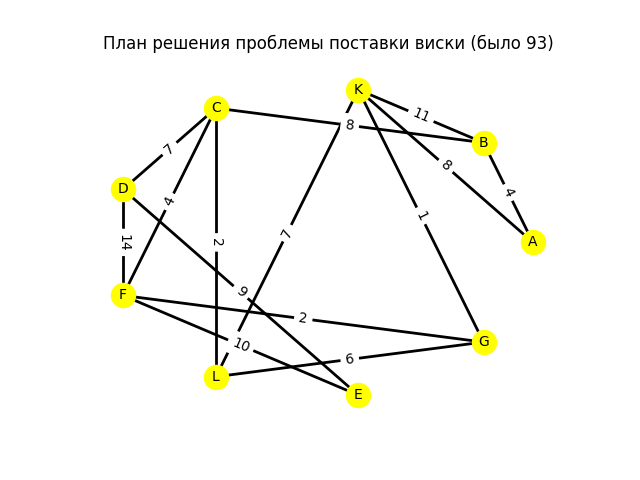
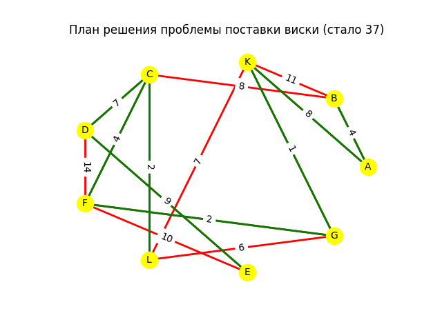
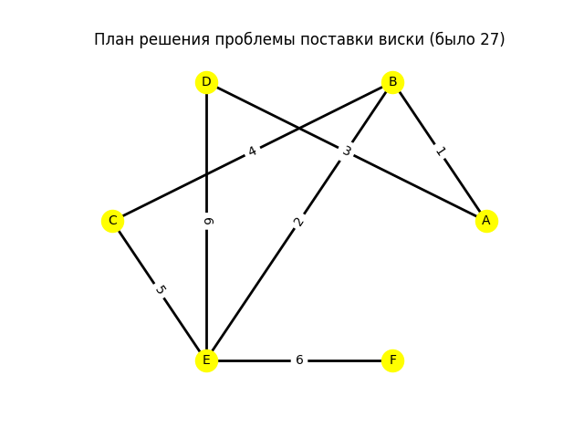
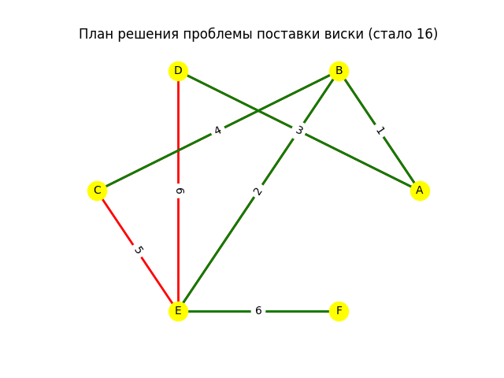
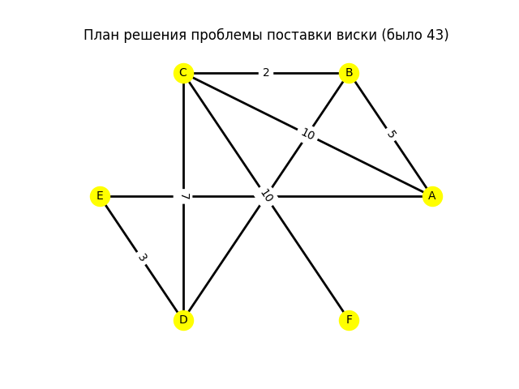
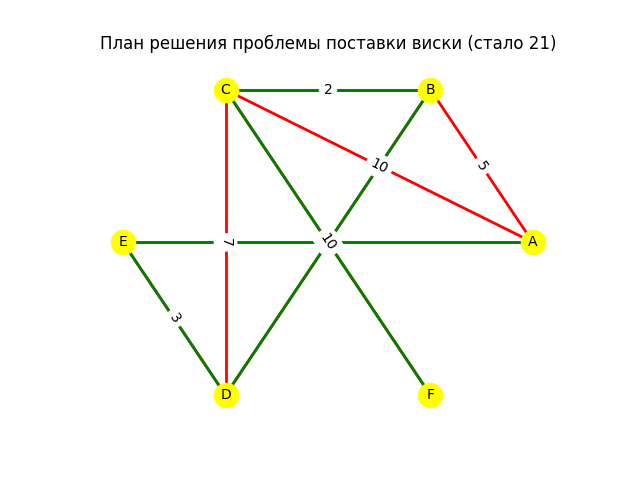

<h1>Проект по Python</h1>
<h2>Постановка задачи</h2>

[Стажёр ФБР хочет решить проблему поставки виски и поймать машину-бегуна. У него возникла мысль: маршрут поставок состоит из кратчайших расстояний между пунктами города. Помогите стажёру решить проблему и повысить должность]

Дан ненаправленный граф - узлы и рёбра (перекрёстки и дороги). Сократите рёбра графа таким образом, чтобы между перекрёстками всё ещё можно было добраться (связность графа не нарушается), но отсутствовали замкнутые маршруты. При этом, общая сумма расстояний рёбер должна быть минимальной.

<h2>Используемые библиотеки</h2>

`pandas` -- для работы с таблицами, мы будем создавать матрицу смежности, обрабатывать её;

`networkx` -- отрисовка графа по матрице смежности;

`matplotlib.pyplot` -- оформление графа, добавление названия, сохранения картики.

<h2>Создание класса вершин</h2>

```python
class Node:
    def __init__(self, name):
        self.name = name
        self.connections = []
        self.index = -1

    def add_connection(self, node, weight):
        self.connections.append([node, weight])
```

<h2>Создание класса  матрицы смежности</h2>

```python

class Matrix:
    def __init__(self, arr_nodes):
        self.size = len(arr_nodes)
        self.nodes = arr_nodes
        for i, node in enumerate(arr_nodes):
            node.index = i
        self.matrix = pd.DataFrame([[0] * self.size for _ in range(self.size)],
                                   columns=[node.name for node in arr_nodes],
                                   index=[node.name for node in arr_nodes])
        for i in range(len(arr_nodes)):
            for j in range(len(arr_nodes[i].connections)):
                self.matrix.iloc[arr_nodes[i].index, arr_nodes[i].connections[j][0].index] = \
                    arr_nodes[i].connections[j][1]
                self.matrix.iloc[arr_nodes[i].connections[j][0].index, arr_nodes[i].index] = \
                    arr_nodes[i].connections[j][1]

    def print_matrix(self):
        print(self.matrix)

    def KruskalMST(self):
        arr, new_arr = [], []

        for node in self.nodes:
            for node_c in node.connections:
                arr.append([node.name, node_c[0].name, node_c[1]])

        arr.sort(key=lambda x: x[2], reverse=False)

        arr_ver_connected = set()  # список соединенных вершин
        group = {}  # словарь списка изолированных групп вершин
        arr_ribs = []  # список ребер остова

        for x in arr:
            if x[0] not in arr_ver_connected or x[
                1] not in arr_ver_connected:  # проверка для исключения циклов в остове
                if x[0] not in arr_ver_connected and x[1] not in arr_ver_connected:  # обе вершины не соединены
                    group[x[0]] = [x[0], x[1]]  # формируем в словаре ключ с номерами вершин
                    group[x[1]] = group[x[0]]  # и связываем их с одним и тем же списком вершин
                else:
                    if not group.get(x[0]):  # в словаре нет первой вершины
                        group[x[1]].append(x[0])  # добавляем в список первую вершину
                        group[x[0]] = group[x[1]]  # добавляем ключ с номером первой вершины
                    else:
                        group[x[0]].append(x[1])  # то же самое делаем со второй вершиной
                        group[x[1]] = group[x[0]]

                arr_ribs.append(x)
                arr_ver_connected.add(x[0])
                arr_ver_connected.add(x[1])

        for x in arr:  # проходим по ребрам второй раз и объединяем разрозненные группы вершин
            if x[1] not in group[x[0]]:  # если вершины принадлежат разным группам, то объединяем
                arr_ribs.append(x)
                gr1 = group[x[0]]
                group[x[0]] += group[x[1]]  # объединяем списки двух групп вершин
                group[x[1]] += gr1

        return arr_ribs
```

<h2>Создание матрицы смежности</h2>

```python
a = Node("A")
b = Node("B")
c = Node("C")
d = Node("D")
e = Node("E")
f = Node("F")

a.add_connection(b, 1)
a.add_connection(d, 3)
b.add_connection(c, 4)
b.add_connection(e, 2)
c.add_connection(e, 5)
d.add_connection(e, 6)
e.add_connection(f, 6)

G = Matrix([a, b, c, d, e, f])

G.print_matrix()

G.matrix.to_csv('data.csv', sep=',', index=False, encoding='utf-8')
```

<h2>Создание графа по матрице смежности</h2>

```python
fig1 = plt.figure()
graph = nx.Graph()

data = pd.read_csv('data.csv')

total_weight = 0
for i in range(data.shape[0]):
    for j in range(i, data.shape[1]):
        total_weight += data.iloc[i, j]
        if data.iloc[i, j] != 0:
            graph.add_edge(f'{data.columns[i]}', f'{data.columns[j]}', weight=data.iloc[i, j])

pos = nx.circular_layout(graph)
nx.draw_networkx_nodes(graph, pos, node_size=300, node_color='yellow')
edge_labels = nx.get_edge_attributes(graph, "weight")
nx.draw_networkx_edge_labels(graph, pos, edge_labels)
nx.draw_networkx_edges(graph, pos, width=2, edge_color='black')
nx.draw_networkx_labels(graph, pos, font_size=10, font_family="sans-serif")
edge_labels = nx.get_edge_attributes(graph, "weight")
nx.draw_networkx_edge_labels(graph, pos, edge_labels)

print(total_weight)

plt.axis("off")
plt.title(rf'План решения проблемы поставки виски (было {total_weight})')
plt.savefig("graph.png")
```

<h2>Применение алгоритма Краскала и создание обновлённого графа</h2>

```python
fig2 = plt.figure()
new_arr = G.KruskalMST()
new_graph = nx.Graph()

total_weight = 0
for x in new_arr:
    new_graph.add_edge(f'{x[0]}', f'{x[1]}', weight=x[2])
    total_weight += x[2]

nx.draw_networkx_nodes(new_graph, pos, node_size=300, node_color='yellow')
edge_labels = nx.get_edge_attributes(graph, "weight")
nx.draw_networkx_edge_labels(graph, pos, edge_labels)
nx.draw_networkx_edges(graph, pos, width=2, edge_color='red')
nx.draw_networkx_edges(new_graph, pos, width=2, edge_color='green')
nx.draw_networkx_labels(graph, pos, font_size=10, font_family="sans-serif")
edge_labels = nx.get_edge_attributes(graph, "weight")
nx.draw_networkx_edge_labels(graph, pos, edge_labels)

print(total_weight)

plt.axis("off")
plt.title(rf'План решения проблемы поставки виски (стало {total_weight})')
plt.savefig("new_data.png")
```

<h2>Несколько примеров работы программы</h2>

| Изначальный граф                  | Граф после применения алгоритмя Краскала |
| --------------------------------- | ------------------------------------- |
|  |  |

| Изначальный граф                  | Граф после применения алгоритмя Краскала |
| --------------------------------- | ------------------------------------- |
|  |  |

| Изначальный граф                  | Граф после применения алгоритмя Краскала |
| --------------------------------- | ------------------------------------- |
|  |  |


